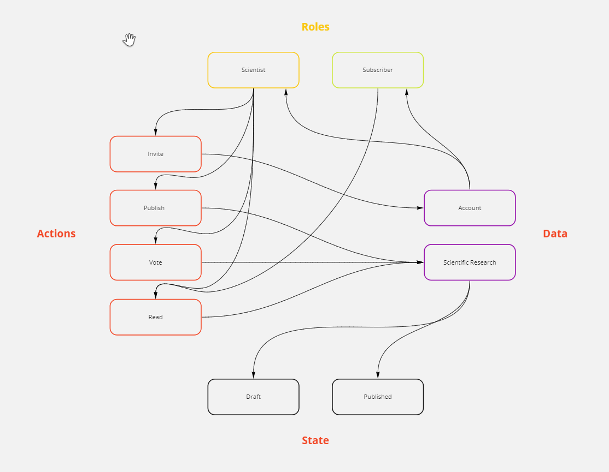

# blockchain-developer-bootcamp-final-project
# Abstract

Decentralized protocol for publishing of scientific research

# Motivation

All of the current ways of publishing scientific research are centralized. It leads to erosion of trust in that process with a huge lack of transparency. Decentralized protocol with a set of internal rules will form an intention to referee only high-quality articles by the scientific society itself.

# Scpecification

The description below is the first draft concept with many uncertainties and contains only minimum value product features.

## Entities

1. Role
    * Scientist is allowed to publish and read any content
    * Subscriber is allowed to read the published and draft content (all the funds should be distributed among the scientists as part of intention rules even with fund creation aka "Nobel Prize", but it's out of confines of the minimum value product)
    * Account without a role is allowed to read only "Abstract" part of the *published* research.
2. Reputation scores are points to be spend for actions: to invite and to publish. They earned by moving a research to the category of "Published" by the consensus.
3. Lifetime reputation score - sum of used and unused reputation scores, determining the weight of the account in consensus of published research.

## Actions

### 1. *Publishing of the research*

To be able to publish scientific research you shoud have the account with "Scientist" role. This action spends some amount of reputation points.

### 2. *Invitation*

To be able to invite others you need to have the "Scientist" role. The invitation creates an account with "Scientist" role and it only one way to create an account with such a role. Account will have default amount of reputation scores to be able publishing the research. This action spends some amount of reputation points.

### 3. *Voting"

To be able to vote you need to have the "Scientist" role. Voting is going on for each draft research seperately. During the voting you have two options:
1. Draft. You decline a referee report of this research. You also should provide a comment with detailed description of the declining reason.
2. Publishing. You referee this research. Comments are optional.
Presumably, each scientist will have reputation scores that form the "weight" in protocol to determine the research with "Published" state. Moving the research to this state is determined during each personal voting until the condition is met. This condition is an open question, the difficulty of building an algorithm is avoiding an iteration whole list of voters. Each voting process for that same research will increase the fees of contract execution. The algorithm must provides a solution to solve this problem.

If research successfully moved by consensus to the "Published" state the associated account gets some amount of reputation points.

### 4. *Subscribe*

To be able to read the research you need to buy the subscription that provides you access to it. The subscription is valid for a certain amount of time (blocks) and requires contract execution with certain amount of network unit (ETH)

### 5. *Read*

To be able to read the research you should have the "Scientist" or "Subscriber" role. In other case you are able to see the "Abstract" part of the published research only.

## Details

Research and voting comments should be stored at third-party networks that provide file storage systems (Filecoin or other), but in the current phase, it will be stored in any traditional database outside of the Ethereum network. Ethereum network will store the content hashes to provide the ability to check the content integrity

## Graphical abstract

